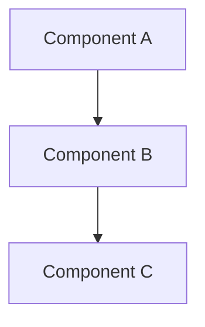

# Spec Design Command

Generate design document based on approved requirements.

## Usage
```
/spec-design [feature-name]
```

## Phase Overview
**Your Role**: Create technical architecture and design

This is Phase 2 of the spec workflow. Your goal is to create a comprehensive technical design that translates requirements into a concrete implementation plan.

## Instructions
You are working on the design phase of the spec workflow.

1. **Prerequisites**
   - Ensure requirements.md exists and is approved in `.claude/specs/{feature-name}/`
   - Load the requirements document from `.claude/specs/{feature-name}/requirements.md`
   - **Load steering documents** (if available): 
     - Check for .claude/steering/tech.md for technical standards
     - Check for .claude/steering/structure.md for project conventions
     - Check for .claude/steering/product.md for product context
   - Research existing codebase patterns and architecture

2. **Process**
   1. Research existing codebase patterns and architecture
   2. Create comprehensive design document including:
      - System overview and architecture
      - Component specifications and interfaces
      - Data models and validation rules
      - Error handling strategies
      - Testing approach
   3. Include Mermaid diagrams for visual representation
   4. Present complete design document
   5. Ask: "Does the design look good? If so, we can move on to the implementation plan."
   6. **CRITICAL**: Wait for explicit approval before proceeding

3. **Codebase Research Phase** (MANDATORY)
   - **Map existing patterns**: Identify data models, API patterns, component structures that match your needs
   - **Cross-reference with tech.md**: Ensure patterns align with documented technical standards
   - **Catalog reusable utilities**: Find validation functions, helpers, middleware, hooks that can be leveraged
   - **Document architectural decisions**: Note existing tech stack, state management, routing patterns to follow
   - **Verify against structure.md**: Ensure file organization follows project conventions
   - **Identify integration points**: Map how new feature connects to existing auth, database, APIs
   - **Find similar implementations**: Look for features with similar requirements already implemented
   - **Note gaps**: Document what needs to be built vs. what can be reused or extended

4. **Design Content** (leverage codebase research and steering documents)
   - **Reuse Architecture**: Build on existing patterns rather than creating new ones
   - **Follow tech.md standards**: Ensure design adheres to documented technical guidelines
   - **Respect structure.md conventions**: Organize components according to project structure
   - **Extend Components**: Design to leverage and extend existing utilities, services, components
   - Use Mermaid diagrams for visual representations
   - Define clear interfaces that integrate with existing systems
   - Specify data models that follow established patterns
   - Plan error handling consistent with current approach
   - Outline testing approach using existing test utilities

5. **Approval Process**
   - Present the complete design document
   - **Highlight code reuse**: Clearly show what existing code will be leveraged
   - **Show steering document alignment**: Note how design follows tech.md and structure.md
   - Ask: "Does the design look good? If so, we can move on to the implementation plan."
   - Incorporate feedback and revisions
   - Continue until explicit approval
   - **CRITICAL**: Do not proceed without explicit approval

## Design Sections Required
- Overview
- Architecture (with Mermaid diagrams)
- Components and Interfaces
- Data Models
- Error Handling
- Testing Strategy

## Design Structure
```markdown
# Design Document

## Overview
[High-level description of the feature and its place in the overall system]

## Steering Document Alignment

### Technical Standards (tech.md)
[How the design follows documented technical patterns and standards]

### Project Structure (structure.md)
[How the implementation will follow project organization conventions]

## Code Reuse Analysis
[What existing code will be leveraged, extended, or integrated]

## Architecture
[Describe the overall architecture and design patterns used]



## Components and Interfaces

### Component 1
- **Purpose:** [What this component does]
- **Interfaces:** [Public methods/APIs]
- **Dependencies:** [What it depends on]
- **Reuses:** [Existing components/utilities it builds upon]

### Component 2
- **Purpose:** [What this component does]
- **Interfaces:** [Public methods/APIs]
- **Dependencies:** [What it depends on]
- **Reuses:** [Existing components/utilities it builds upon]

## Data Models
[Data structures following established patterns]

## Error Handling
[Error scenarios consistent with current approach]

## Testing Strategy
[Testing approach using existing utilities and patterns]
```

## Critical Rules
- **NEVER** proceed to the next phase without explicit user approval
- Accept only clear affirmative responses: "yes", "approved", "looks good", etc.
- If user provides feedback, make revisions and ask for approval again
- Continue revision cycle until explicit approval is received

## Next Phase
After approval, proceed to `/spec-tasks`.
