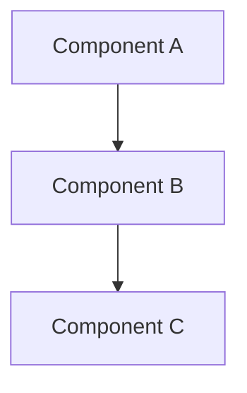

# Design Document

## Overview

[High-level description of the feature and its place in the overall system]

## Architecture

[Describe the overall architecture and design patterns used]



## Components and Interfaces

### Component 1
- **Purpose:** [What this component does]
- **Interfaces:** [Public methods/APIs]
- **Dependencies:** [What it depends on]

### Component 2
- **Purpose:** [What this component does]
- **Interfaces:** [Public methods/APIs]
- **Dependencies:** [What it depends on]

## Data Models

### Model 1
```typescript
interface Model1 {
  id: string;
  name: string;
  // Additional properties
}
```

### Model 2
```typescript
interface Model2 {
  id: string;
  // Additional properties
}
```

## Error Handling

### Error Scenarios
1. **Scenario 1:** [Description]
   - **Handling:** [How to handle]
   - **User Impact:** [What user sees]

2. **Scenario 2:** [Description]
   - **Handling:** [How to handle]
   - **User Impact:** [What user sees]

## Testing Strategy

### Unit Testing
- [Unit testing approach]
- [Key components to test]

### Integration Testing
- [Integration testing approach]
- [Key flows to test]

### End-to-End Testing
- [E2E testing approach]
- [User scenarios to test]
