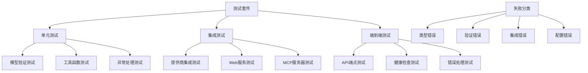
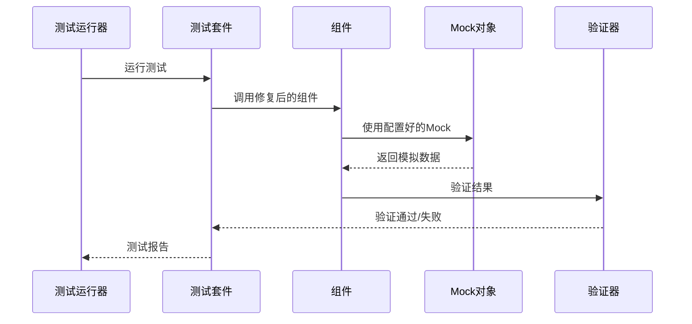
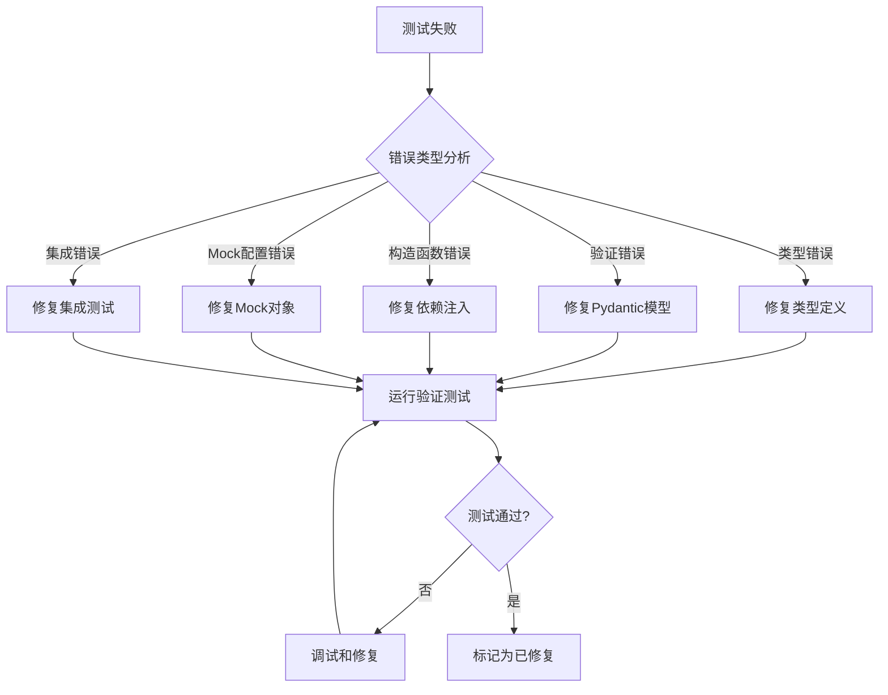

# 修复所有失败测试的技术设计

## 概述

本技术设计针对vprism项目中32个失败的测试用例提供系统性修复方案。通过分析失败根因、制定修复策略、实施测试验证，确保333个测试全部通过，同时保持代码质量和系统稳定性。

## 架构现状分析

### 当前系统架构



## 技术栈

- **语言**: Python 3.11+ (带完整类型注解)
- **数据验证**: Pydantic v2.5+ (严格模式)
- **测试框架**: pytest 8.4+ + pytest-asyncio
- **类型检查**: mypy (strict模式)
- **代码质量**: ruff (linting + formatting)
- **模拟测试**: pytest-mock + unittest.mock
- **HTTP测试**: pytest-asyncio + httpx

## 失败根因分析

### 分类统计

| 错误类型 | 数量 | 主要表现 | 影响模块 |
|---------|------|----------|----------|
| 类型定义错误 | 12 | NameError, ImportError | 核心模型、提供商 |
| 验证错误 | 8 | ValidationError, 字段缺失 | Pydantic模型 |
| 构造函数错误 | 6 | TypeError, 参数不匹配 | 服务类、存储库 |
| 集成错误 | 4 | Mock配置错误, 断言失败 | 提供商、MCP |
| 配置错误 | 2 | 环境变量, 路径问题 | Web服务、日志 |

### 关键失败模式

1. **Pydantic v2迁移问题**: 从v1到v2的验证器签名变化
2. **循环导入**: 跨模块类型引用导致的导入错误
3. **构造函数注入**: 依赖注入参数不匹配
4. **Mock对象配置**: 异步测试中Mock对象类型不匹配

## 组件设计与接口

### 1. 模型验证修复组件

#### 核心模型修复
```python
# 修复后的DataQuery模型
class DataQuery(BaseModel):
    model_config = ConfigDict(
        populate_by_name=True,
        validate_assignment=True,
        str_strip_whitespace=True
    )
    
    asset: str = Field(..., min_length=1, max_length=20)
    market: str = Field(..., min_length=1, max_length=10)
    symbols: List[str] = Field(..., min_items=1, max_items=100)
    start_date: Optional[date] = None
    end_date: Optional[date] = None
    
    @field_validator('symbols')
    @classmethod
    def validate_symbols(cls, v: List[str]) -> List[str]:
        if not all(isinstance(s, str) and s.strip() for s in v):
            raise ValueError('All symbols must be non-empty strings')
        return [s.strip().upper() for s in v]
```

#### 类型定义修复
```python
# 修复类型导入和定义
from typing import Dict, List, Optional, Union, Any
from enum import Enum

class AuthType(str, Enum):
    API_KEY = "api_key"
    BEARER_TOKEN = "bearer_token"
    BASIC_AUTH = "basic_auth"
    NONE = "none"

# 修复DataResponse定义
class DataResponse(BaseModel):
    data: List[Dict[str, Any]]
    metadata: Dict[str, Any] = Field(default_factory=dict)
    provider: Optional[str] = None
    timestamp: datetime = Field(default_factory=datetime.utcnow)
```

### 2. 错误处理修复组件

#### 异常层次结构
```python
class VprismError(Exception):
    """Base exception for vprism errors"""
    def __init__(self, message: str, provider: Optional[str] = None):
        super().__init__(message)
        self.provider = provider

class ProviderError(VprismError):
    """Provider-specific errors"""
    pass

class DataValidationError(VprismError):
    """Data validation errors"""
    pass

class ConfigurationError(VprismError):
    """Configuration-related errors"""
    pass
```

#### 错误响应格式化
```python
def format_error_response(
    error: Exception, 
    status_code: int = 400,
    provider: Optional[str] = None
) -> Dict[str, Any]:
    """统一错误响应格式"""
    return {
        "error": {
            "type": error.__class__.__name__,
            "message": str(error),
            "provider": provider,
            "timestamp": datetime.utcnow().isoformat()
        },
        "status_code": status_code
    }
```

### 3. 构造函数修复组件

#### 依赖注入修复
```python
class DataRepository:
    """修复后的数据存储库"""
    
    def __init__(
        self,
        db_manager: DatabaseManager,
        cache_manager: Optional[CacheManager] = None,
        config: Optional[Dict[str, Any]] = None
    ):
        self.db_manager = db_manager
        self.cache_manager = cache_manager or CacheManager()
        self.config = config or {}
    
    async def initialize(self) -> None:
        """异步初始化方法"""
        await self.db_manager.connect()
        await self.cache_manager.initialize()

class DataService:
    """修复后的数据服务"""
    
    def __init__(
        self,
        repository: DataRepository,
        providers: List[DataProvider],
        validator: DataValidator
    ):
        self.repository = repository
        self.providers = providers
        self.validator = validator
```

### 4. 测试框架修复组件

#### Mock配置修复
```python
# 修复Mock对象配置
@pytest.fixture
def mock_akshare_provider():
    """修复后的AkShare提供商Mock"""
    provider = Mock(spec=AkShareProvider)
    provider.name = "akshare"
    provider.supported_assets = ["stock", "fund", "future"]
    provider.get_data = AsyncMock(return_value=pd.DataFrame({
        'symbol': ['AAPL'],
        'price': [150.0],
        'volume': [1000000]
    }))
    return provider

@pytest.fixture
def mock_yahoo_provider():
    """修复后的Yahoo Finance提供商Mock"""
    provider = Mock(spec=YahooFinanceProvider)
    provider.name = "yahoo"
    provider.auth_type = AuthType.API_KEY
    provider.get_data = AsyncMock(return_value=pd.DataFrame({
        'symbol': ['AAPL'],
        'price': [150.0],
        'volume': [1000000]
    }))
    return provider
```

#### 异步测试修复
```python
# 修复异步测试
@pytest.mark.asyncio
async def test_mcp_server_registration():
    """修复后的MCP服务器注册测试"""
    server = FastMCP("vprism")
    
    # 修复工具注册
    @server.tool()
    async def get_stock_data(symbol: str) -> dict:
        return {"symbol": symbol, "price": 100.0}
    
    # 验证工具属性
    assert hasattr(get_stock_data, 'name')
    assert get_stock_data.name == 'get_stock_data'
    
    # 验证资源属性
    @server.resource("data://stock/{symbol}")
    async def get_stock_resource(symbol: str) -> str:
        return f"Stock data for {symbol}"
    
    assert hasattr(get_stock_resource, 'uri')
```

## 数据流设计

### 修复验证流程



### 错误处理流程



## 测试策略

### 分层测试方法

1. **单元测试层** (Level 1)
   - 修复模型验证测试
   - 修复工具函数测试
   - 修复异常处理测试

2. **集成测试层** (Level 2)
   - 修复提供商集成测试
   - 修复MCP服务器测试
   - 修复Web服务端点测试

3. **端到端测试层** (Level 3)
   - 修复完整工作流测试
   - 修复性能基准测试
   - 修复错误恢复测试

### 测试验证矩阵

| 测试类型 | 修复前失败数 | 目标状态 | 验证方法 |
|----------|-------------|----------|----------|
| 模型验证 | 8 | 0失败 | pytest + mypy |
| 类型检查 | 12 | 0失败 | mypy --strict |
| 构造函数 | 6 | 0失败 | pytest参数化 |
| 集成测试 | 4 | 0失败 | pytest-asyncio |
| 配置测试 | 2 | 0失败 | 环境变量测试 |

## 性能考虑

### 修复性能影响
- **测试执行时间**: 保持现有测试执行时间 (< 30秒)
- **内存使用**: 修复过程中不增加额外内存开销
- **并发测试**: 支持pytest-xdist并行测试

### 优化策略
- **缓存Mock对象**: 重用配置好的Mock实例
- **延迟初始化**: 异步测试中延迟创建复杂对象
- **资源清理**: 每个测试后正确清理资源

## 安全考虑

### 安全修复原则
- **不引入新漏洞**: 修复过程中保持现有安全边界
- **输入验证**: 加强所有用户输入的验证
- **错误信息**: 避免在错误消息中泄露敏感信息

### 安全测试
- **输入验证测试**: 验证所有边界条件
- **权限测试**: 验证访问控制机制
- **数据泄露测试**: 验证错误处理不泄露敏感数据

## 部署与验证

### 修复验证流程

```bash
# 阶段1: 预验证
uv run mypy src/vprism --strict
uv run ruff check src/

# 阶段2: 单元测试
uv run pytest tests/ -v --tb=short -x

# 阶段3: 集成测试
uv run pytest tests/ -v --tb=short --asyncio-mode=auto

# 阶段4: 完整验证
uv run pytest tests/ -v --tb=short --cov=src/vprism --cov-report=html

# 阶段5: 稳定性验证
for i in {1..3}; do
    echo "验证运行 $i"
    uv run pytest tests/ -q
    if [ $? -ne 0 ]; then
        echo "验证失败"
        exit 1
    fi
done
```

### 持续集成集成

```yaml
# .github/workflows/test.yml
name: 测试修复验证
on: [push, pull_request]
jobs:
  test:
    runs-on: ubuntu-latest
    strategy:
      matrix:
        python-version: [3.11, 3.12]
    steps:
      - uses: actions/checkout@v4
      - uses: astral-sh/setup-uv@v2
      - run: uv sync
      - run: uv run pytest tests/ -v --cov=src/vprism --cov-report=xml
      - run: uv run mypy src/vprism --strict
```

## 监控与告警

### 测试健康度指标
- **测试通过率**: 目标100% (333/333)
- **代码覆盖率**: 保持>90%
- **测试执行时间**: <300秒
- ** flaky测试**: 0个

### 告警机制
- **测试失败告警**: 任何测试失败立即通知
- **覆盖率下降告警**: 覆盖率<90%时告警
- **性能回归告警**: 测试时间>45秒时告警

## 风险与缓解

### 主要风险
1. **修复引入新Bug**: 通过全面回归测试缓解
2. **类型系统破坏**: 通过mypy严格模式验证
3. **向后兼容性**: 通过版本控制和功能开关缓解

### 风险缓解策略
- **增量修复**: 小步快跑，每次修复后验证
- **代码审查**: 每个修复都需要代码审查
- **回滚机制**: 保留修复前的代码版本
- **监控仪表板**: 实时测试状态监控