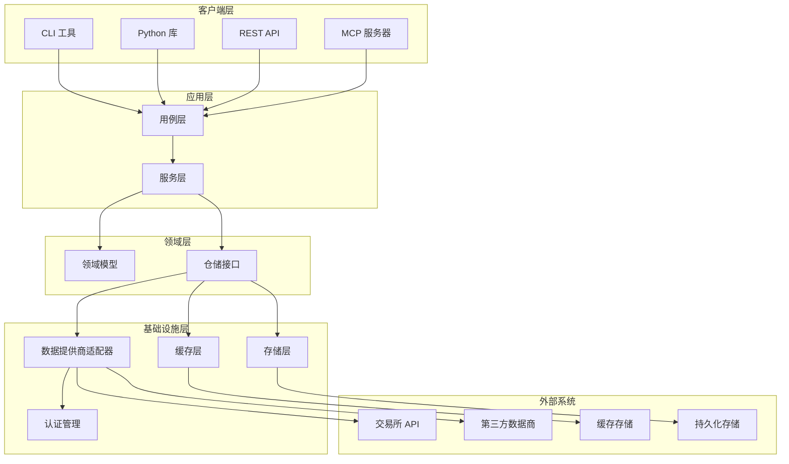
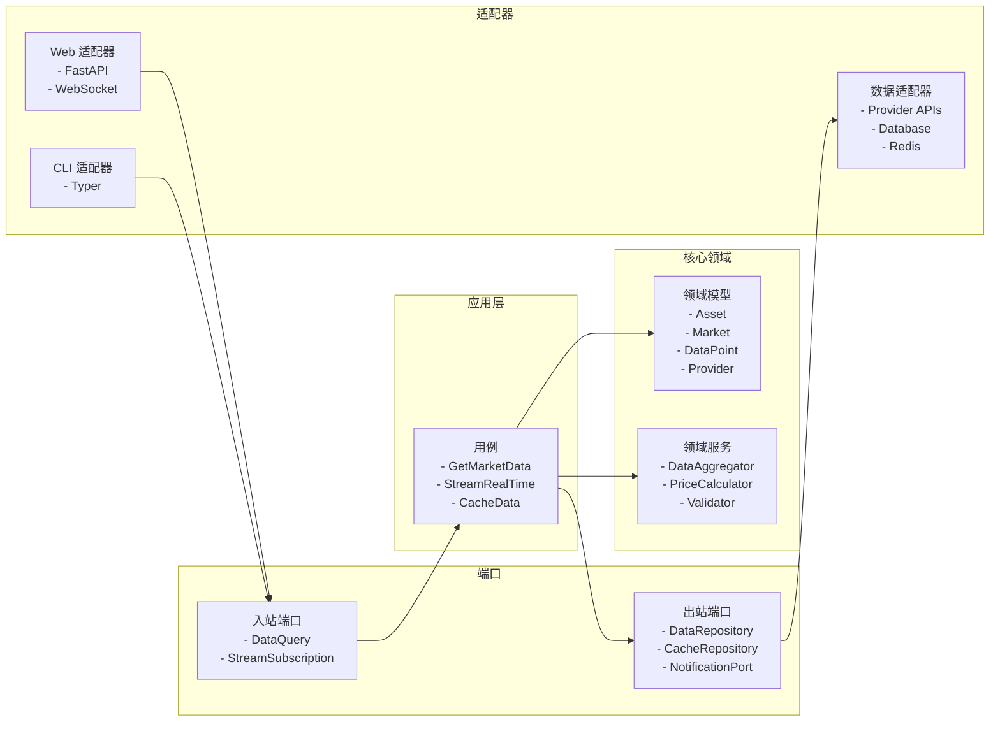
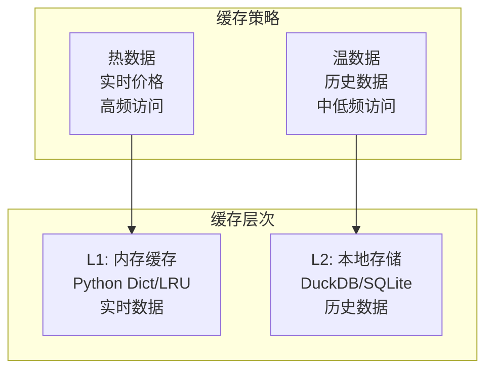
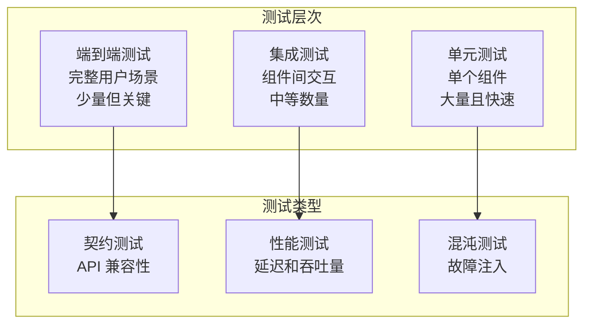

# vprism 系统设计文档

## 概述

vprism 是一个现代化的金融数据基础设施平台，旨在解决 akshare 等传统金融数据库的架构问题。通过采用领域驱动设计（DDD）、清洁架构原则和现代 Python 技术栈，vprism 提供统一的、可组合的 API 接口，支持多模态部署，为个人开发者到企业级应用提供高性能、可扩展的金融数据访问解决方案。

### 核心设计原则

1. **统一性优于分散性**：用一个可组合的 API 替代 1000+ 个分散函数
2. **现代性优于兼容性**：采用最新的 Python 生态系统和最佳实践
3. **可扩展性优于简单性**：设计支持从个人使用到企业级部署的扩展
4. **类型安全优于运行时检查**：100% 类型提示和编译时验证
5. **异步优于同步**：原生支持异步操作和并发处理

## 架构

### 高层架构



### 领域驱动设计架构

系统采用六边形架构（端口和适配器模式），确保业务逻辑与外部依赖的解耦：



## 组件和接口

### 核心组件架构

#### 1. 统一数据访问层 (Unified Data Access Layer)

```python
# 核心接口设计
class DataQuery:
    asset: AssetType
    market: Optional[MarketType] = None
    provider: Optional[ProviderType] = None
    timeframe: Optional[TimeFrame] = None
    start: Optional[datetime] = None
    end: Optional[datetime] = None
    symbols: Optional[List[str]] = None
    
class DataResponse:
    data: List[DataPoint]
    metadata: ResponseMetadata
    source: ProviderInfo
    cached: bool
    timestamp: datetime
```

#### 2. 提供商抽象层 (Provider Abstraction Layer)

```python
# 提供商接口
class DataProvider(ABC):
    @abstractmethod
    async def get_data(self, query: DataQuery) -> DataResponse:
        pass
    
    @abstractmethod
    async def stream_data(self, query: DataQuery) -> AsyncIterator[DataPoint]:
        pass
    
    @property
    @abstractmethod
    def supported_assets(self) -> Set[AssetType]:
        pass
    
    @property
    @abstractmethod
    def rate_limits(self) -> RateLimitConfig:
        pass
```

#### 3. 智能路由器 (Intelligent Router)

```python
class DataRouter:
    def __init__(self, providers: List[DataProvider]):
        self.providers = providers
        self.provider_registry = ProviderRegistry(providers)
    
    async def route_query(self, query: DataQuery) -> DataProvider:
        # 智能选择最佳提供商
        candidates = self.provider_registry.find_providers(query)
        return await self.select_best_provider(candidates, query)
    
    async def select_best_provider(
        self, 
        candidates: List[DataProvider], 
        query: DataQuery
    ) -> DataProvider:
        # 基于延迟、可用性、成本等因素选择
        pass
```

### 数据模型设计

#### 核心领域模型

```python
from pydantic import BaseModel, Field
from enum import Enum
from datetime import datetime
from decimal import Decimal
from typing import Optional, Dict, Any

class AssetType(str, Enum):
    STOCK = "stock"
    BOND = "bond"
    ETF = "etf"
    FUND = "fund"
    FUTURES = "futures"
    OPTIONS = "options"
    FOREX = "forex"
    CRYPTO = "crypto"
    INDEX = "index"
    COMMODITY = "commodity"

class MarketType(str, Enum):
    CN = "cn"  # 中国
    US = "us"  # 美国
    HK = "hk"  # 香港
    EU = "eu"  # 欧洲
    JP = "jp"  # 日本
    GLOBAL = "global"

class TimeFrame(str, Enum):
    TICK = "tick"
    MINUTE_1 = "1m"
    MINUTE_5 = "5m"
    MINUTE_15 = "15m"
    MINUTE_30 = "30m"
    HOUR_1 = "1h"
    HOUR_4 = "4h"
    DAY_1 = "1d"
    WEEK_1 = "1w"
    MONTH_1 = "1M"

class DataPoint(BaseModel):
    symbol: str
    timestamp: datetime
    open: Optional[Decimal] = None
    high: Optional[Decimal] = None
    low: Optional[Decimal] = None
    close: Optional[Decimal] = None
    volume: Optional[Decimal] = None
    amount: Optional[Decimal] = None
    extra_fields: Dict[str, Any] = Field(default_factory=dict)
    
    class Config:
        json_encoders = {
            Decimal: str,
            datetime: lambda v: v.isoformat()
        }

class Asset(BaseModel):
    symbol: str
    name: str
    asset_type: AssetType
    market: MarketType
    currency: str
    exchange: Optional[str] = None
    sector: Optional[str] = None
    industry: Optional[str] = None
    metadata: Dict[str, Any] = Field(default_factory=dict)
```

### 缓存和存储策略

#### 多层缓存架构



#### 缓存实现

```python
from typing import Dict, Optional, Any
from datetime import datetime, timedelta
import threading
from collections import OrderedDict

class CacheStrategy(ABC):
    @abstractmethod
    async def get(self, key: str) -> Optional[Any]:
        pass
    
    @abstractmethod
    async def set(self, key: str, value: Any, ttl: Optional[int] = None):
        pass

class InMemoryLRUCache:
    """线程安全的内存 LRU 缓存"""
    def __init__(self, max_size: int = 1000):
        self.max_size = max_size
        self.cache: OrderedDict = OrderedDict()
        self.expiry: Dict[str, datetime] = {}
        self.lock = threading.RLock()
    
    async def get(self, key: str) -> Optional[Any]:
        with self.lock:
            if key in self.expiry and datetime.now() > self.expiry[key]:
                self._remove_expired(key)
                return None
            
            if key in self.cache:
                # Move to end (most recently used)
                self.cache.move_to_end(key)
                return self.cache[key]
            return None
    
    async def set(self, key: str, value: Any, ttl: Optional[int] = None):
        with self.lock:
            if key in self.cache:
                self.cache.move_to_end(key)
            else:
                if len(self.cache) >= self.max_size:
                    # Remove least recently used
                    oldest_key = next(iter(self.cache))
                    self._remove_expired(oldest_key)
            
            self.cache[key] = value
            if ttl:
                self.expiry[key] = datetime.now() + timedelta(seconds=ttl)
    
    def _remove_expired(self, key: str):
        self.cache.pop(key, None)
        self.expiry.pop(key, None)

class DuckDBCache:
    """DuckDB 本地存储缓存"""
    def __init__(self, db_path: str = "vprism_cache.duckdb"):
        self.db_path = db_path
        self._init_tables()
    
    def _init_tables(self):
        """初始化扁平化数据表结构"""
        # 统一的蜡烛图数据表（OHLCV）
        self._create_ohlcv_table()
        # 资产基础信息表
        self._create_assets_table()
        # 实时报价数据表
        self._create_quotes_table()
        # 财务数据表
        self._create_financials_table()
        # 新闻和公告表
        self._create_news_table()
        # 数据提供商元数据表
        self._create_provider_metadata_table()
    
    def _create_ohlcv_table(self):
        """统一的 OHLCV 蜡烛图数据表"""
        sql = """
        CREATE TABLE IF NOT EXISTS ohlcv_data (
            id BIGINT PRIMARY KEY,
            symbol VARCHAR(32) NOT NULL,
            asset_type VARCHAR(16) NOT NULL,  -- stock, etf, bond, futures, etc.
            market VARCHAR(8) NOT NULL,       -- cn, us, hk, etc.
            exchange VARCHAR(16),             -- sse, szse, nasdaq, etc.
            timeframe VARCHAR(8) NOT NULL,    -- 1m, 5m, 1h, 1d, etc.
            timestamp TIMESTAMP NOT NULL,
            open_price DECIMAL(18,6),
            high_price DECIMAL(18,6),
            low_price DECIMAL(18,6),
            close_price DECIMAL(18,6),
            volume DECIMAL(20,2),
            amount DECIMAL(20,2),             -- 成交额
            turnover_rate DECIMAL(8,4),       -- 换手率
            price_change DECIMAL(18,6),       -- 价格变动
            price_change_pct DECIMAL(8,4),    -- 价格变动百分比
            provider VARCHAR(32) NOT NULL,    -- 数据来源
            data_quality_score DECIMAL(3,2),  -- 数据质量评分 0-1
            created_at TIMESTAMP DEFAULT CURRENT_TIMESTAMP,
            updated_at TIMESTAMP DEFAULT CURRENT_TIMESTAMP
        );
        
        -- 创建复合索引优化查询性能
        CREATE INDEX IF NOT EXISTS idx_ohlcv_symbol_time 
        ON ohlcv_data(symbol, timeframe, timestamp DESC);
        CREATE INDEX IF NOT EXISTS idx_ohlcv_market_asset 
        ON ohlcv_data(market, asset_type, timestamp DESC);
        """
    
    def _create_assets_table(self):
        """资产基础信息表"""
        sql = """
        CREATE TABLE IF NOT EXISTS assets (
            id BIGINT PRIMARY KEY,
            symbol VARCHAR(32) NOT NULL UNIQUE,
            name VARCHAR(256),
            full_name VARCHAR(512),
            asset_type VARCHAR(16) NOT NULL,
            market VARCHAR(8) NOT NULL,
            exchange VARCHAR(16),
            currency VARCHAR(8),
            sector VARCHAR(64),
            industry VARCHAR(128),
            country VARCHAR(8),
            isin VARCHAR(32),              -- 国际证券识别码
            cusip VARCHAR(16),             -- 美国证券识别码
            listing_date DATE,
            delisting_date DATE,
            is_active BOOLEAN DEFAULT TRUE,
            market_cap DECIMAL(20,2),      -- 市值
            shares_outstanding DECIMAL(20,2), -- 流通股本
            provider VARCHAR(32) NOT NULL,
            metadata_json TEXT,            -- 额外元数据 JSON
            created_at TIMESTAMP DEFAULT CURRENT_TIMESTAMP,
            updated_at TIMESTAMP DEFAULT CURRENT_TIMESTAMP
        );
        
        CREATE INDEX IF NOT EXISTS idx_assets_type_market 
        ON assets(asset_type, market, is_active);
        CREATE INDEX IF NOT EXISTS idx_assets_sector 
        ON assets(sector, industry);
        """
    
    def _create_quotes_table(self):
        """实时报价数据表"""
        sql = """
        CREATE TABLE IF NOT EXISTS real_time_quotes (
            id BIGINT PRIMARY KEY,
            symbol VARCHAR(32) NOT NULL,
            asset_type VARCHAR(16) NOT NULL,
            market VARCHAR(8) NOT NULL,
            timestamp TIMESTAMP NOT NULL,
            current_price DECIMAL(18,6),
            bid_price DECIMAL(18,6),
            ask_price DECIMAL(18,6),
            bid_size DECIMAL(20,2),
            ask_size DECIMAL(20,2),
            volume_today DECIMAL(20,2),
            amount_today DECIMAL(20,2),
            high_today DECIMAL(18,6),
            low_today DECIMAL(18,6),
            open_today DECIMAL(18,6),
            prev_close DECIMAL(18,6),
            price_change DECIMAL(18,6),
            price_change_pct DECIMAL(8,4),
            turnover_rate DECIMAL(8,4),
            pe_ratio DECIMAL(8,2),
            pb_ratio DECIMAL(8,2),
            provider VARCHAR(32) NOT NULL,
            created_at TIMESTAMP DEFAULT CURRENT_TIMESTAMP
        );
        
        CREATE INDEX IF NOT EXISTS idx_quotes_symbol_time 
        ON real_time_quotes(symbol, timestamp DESC);
        """
    
    def _create_financials_table(self):
        """财务数据表（扁平化设计）"""
        sql = """
        CREATE TABLE IF NOT EXISTS financial_data (
            id BIGINT PRIMARY KEY,
            symbol VARCHAR(32) NOT NULL,
            report_date DATE NOT NULL,
            report_type VARCHAR(16) NOT NULL,  -- annual, quarterly
            fiscal_year INTEGER,
            fiscal_quarter INTEGER,
            
            -- 资产负债表数据
            total_assets DECIMAL(20,2),
            total_liabilities DECIMAL(20,2),
            shareholders_equity DECIMAL(20,2),
            current_assets DECIMAL(20,2),
            current_liabilities DECIMAL(20,2),
            cash_and_equivalents DECIMAL(20,2),
            
            -- 利润表数据
            total_revenue DECIMAL(20,2),
            gross_profit DECIMAL(20,2),
            operating_income DECIMAL(20,2),
            net_income DECIMAL(20,2),
            ebitda DECIMAL(20,2),
            eps DECIMAL(8,4),               -- 每股收益
            
            -- 现金流量表数据
            operating_cash_flow DECIMAL(20,2),
            investing_cash_flow DECIMAL(20,2),
            financing_cash_flow DECIMAL(20,2),
            free_cash_flow DECIMAL(20,2),
            
            -- 财务比率
            roe DECIMAL(8,4),               -- 净资产收益率
            roa DECIMAL(8,4),               -- 总资产收益率
            debt_to_equity DECIMAL(8,4),    -- 负债权益比
            current_ratio DECIMAL(8,4),     -- 流动比率
            
            provider VARCHAR(32) NOT NULL,
            created_at TIMESTAMP DEFAULT CURRENT_TIMESTAMP,
            updated_at TIMESTAMP DEFAULT CURRENT_TIMESTAMP
        );
        
        CREATE INDEX IF NOT EXISTS idx_financials_symbol_date 
        ON financial_data(symbol, report_date DESC);
        """
    
    def _create_news_table(self):
        """新闻和公告数据表"""
        sql = """
        CREATE TABLE IF NOT EXISTS news_data (
            id BIGINT PRIMARY KEY,
            symbol VARCHAR(32),              -- 可为空，表示市场级别新闻
            title VARCHAR(512) NOT NULL,
            content TEXT,
            summary VARCHAR(1024),
            publish_time TIMESTAMP NOT NULL,
            source VARCHAR(128),
            author VARCHAR(128),
            category VARCHAR(64),            -- earnings, merger, regulatory, etc.
            sentiment_score DECIMAL(3,2),    -- 情感分析得分 -1 到 1
            importance_score DECIMAL(3,2),   -- 重要性得分 0 到 1
            url VARCHAR(512),
            language VARCHAR(8) DEFAULT 'zh',
            provider VARCHAR(32) NOT NULL,
            created_at TIMESTAMP DEFAULT CURRENT_TIMESTAMP
        );
        
        CREATE INDEX IF NOT EXISTS idx_news_symbol_time 
        ON news_data(symbol, publish_time DESC);
        CREATE INDEX IF NOT EXISTS idx_news_category 
        ON news_data(category, publish_time DESC);
        """
    
    def _create_provider_metadata_table(self):
        """数据提供商元数据表"""
        sql = """
        CREATE TABLE IF NOT EXISTS provider_metadata (
            id BIGINT PRIMARY KEY,
            provider_name VARCHAR(32) NOT NULL,
            data_type VARCHAR(32) NOT NULL,   -- ohlcv, quote, financial, news
            symbol VARCHAR(32),
            last_update TIMESTAMP,
            update_frequency INTEGER,         -- 更新频率（秒）
            data_delay INTEGER,              -- 数据延迟（秒）
            quality_score DECIMAL(3,2),      -- 数据质量评分
            cost_per_request DECIMAL(10,6),  -- 每次请求成本
            rate_limit_per_minute INTEGER,
            is_active BOOLEAN DEFAULT TRUE,
            error_count INTEGER DEFAULT 0,
            success_count INTEGER DEFAULT 0,
            last_error_time TIMESTAMP,
            last_error_message TEXT,
            created_at TIMESTAMP DEFAULT CURRENT_TIMESTAMP,
            updated_at TIMESTAMP DEFAULT CURRENT_TIMESTAMP
        );
        
        CREATE INDEX IF NOT EXISTS idx_provider_meta 
        ON provider_metadata(provider_name, data_type, symbol);
        """
    
    async def get(self, key: str) -> Optional[Any]:
        """从 DuckDB 查询缓存数据"""
        # 解析缓存键，确定查询类型和参数
        query_info = self._parse_cache_key(key)
        
        if query_info['data_type'] == 'ohlcv':
            return await self._get_ohlcv_data(query_info)
        elif query_info['data_type'] == 'quote':
            return await self._get_quote_data(query_info)
        # ... 其他数据类型
        
        return None
    
    async def set(self, key: str, value: Any, ttl: Optional[int] = None):
        """存储数据到 DuckDB"""
        # 根据数据类型存储到相应表
        pass
    
    def _parse_cache_key(self, key: str) -> Dict[str, Any]:
        """解析缓存键获取查询信息"""
        # 实现缓存键解析逻辑
        pass

class MultiLevelCache:
    def __init__(self):
        self.l1_cache = InMemoryLRUCache(max_size=1000)  # 内存缓存
        self.l2_cache = DuckDBCache()  # 本地数据库缓存
    
    async def get_data(self, query: DataQuery) -> Optional[DataResponse]:
        # 先查 L1 内存缓存
        cache_key = query.cache_key()
        result = await self.l1_cache.get(cache_key)
        if result:
            return result
        
        # 再查 L2 数据库缓存
        result = await self.l2_cache.get(cache_key)
        if result:
            # 回填到 L1 缓存
            await self.l1_cache.set(cache_key, result, ttl=300)  # 5分钟
            return result
        
        return None
    
    async def set_data(self, query: DataQuery, data: DataResponse):
        cache_key = query.cache_key()
        
        # 存储到 L1 缓存（实时数据）
        if query.is_realtime():
            await self.l1_cache.set(cache_key, data, ttl=60)  # 1分钟
        
        # 存储到 L2 缓存（历史数据）
        await self.l2_cache.set(cache_key, data)
```

## 错误处理

### 统一错误处理架构

```python
class VPrismException(Exception):
    """vprism 基础异常类"""
    def __init__(self, message: str, error_code: str, details: Dict[str, Any] = None):
        self.message = message
        self.error_code = error_code
        self.details = details or {}
        super().__init__(message)

class ProviderException(VPrismException):
    """数据提供商相关异常"""
    pass

class RateLimitException(ProviderException):
    """速率限制异常"""
    pass

class DataValidationException(VPrismException):
    """数据验证异常"""
    pass

class ErrorHandler:
    async def handle_provider_error(self, error: Exception, provider: str) -> DataResponse:
        if isinstance(error, RateLimitException):
            # 实施退避策略
            await self.backoff_strategy.wait()
            # 尝试备用提供商
            return await self.try_fallback_provider()
        elif isinstance(error, ProviderException):
            # 记录错误并返回错误响应
            logger.error(f"Provider {provider} failed: {error}")
            return self.create_error_response(error)
        else:
            # 未知错误，重新抛出
            raise error
```

### 故障转移和重试机制

```python
class FaultTolerantDataService:
    def __init__(self, providers: List[DataProvider]):
        self.providers = providers
        self.circuit_breaker = CircuitBreaker()
        self.retry_policy = ExponentialBackoffRetry()
    
    async def get_data_with_fallback(self, query: DataQuery) -> DataResponse:
        for provider in self.providers:
            try:
                if self.circuit_breaker.is_open(provider.name):
                    continue
                
                return await self.retry_policy.execute(
                    lambda: provider.get_data(query)
                )
            except Exception as e:
                self.circuit_breaker.record_failure(provider.name)
                logger.warning(f"Provider {provider.name} failed: {e}")
                continue
        
        raise NoAvailableProviderException("All providers failed")
```

## 测试策略

### 测试金字塔



### 测试实现策略

```python
# 单元测试示例
class TestDataRouter:
    @pytest.fixture
    def mock_providers(self):
        return [
            MockProvider("provider_a", [AssetType.STOCK]),
            MockProvider("provider_b", [AssetType.BOND])
        ]
    
    @pytest.mark.asyncio
    async def test_route_stock_query(self, mock_providers):
        router = DataRouter(mock_providers)
        query = DataQuery(asset=AssetType.STOCK, market=MarketType.CN)
        
        provider = await router.route_query(query)
        
        assert provider.name == "provider_a"
        assert AssetType.STOCK in provider.supported_assets

# 集成测试示例
class TestDataService:
    @pytest.mark.integration
    async def test_get_stock_data_with_cache(self):
        service = DataService()
        query = DataQuery(
            asset=AssetType.STOCK,
            market=MarketType.CN,
            symbols=["000001"]
        )
        
        # 第一次请求应该从提供商获取
        response1 = await service.get_data(query)
        assert not response1.cached
        
        # 第二次请求应该从缓存获取
        response2 = await service.get_data(query)
        assert response2.cached

# 性能测试示例
class TestPerformance:
    @pytest.mark.performance
    async def test_concurrent_requests(self):
        service = DataService()
        queries = [
            DataQuery(asset=AssetType.STOCK, symbols=[f"00000{i}"])
            for i in range(100)
        ]
        
        start_time = time.time()
        responses = await asyncio.gather(*[
            service.get_data(query) for query in queries
        ])
        end_time = time.time()
        
        assert len(responses) == 100
        assert end_time - start_time < 5.0  # 5秒内完成100个请求
```

### 测试数据管理

```python
class TestDataFactory:
    @staticmethod
    def create_stock_data(symbol: str = "000001", days: int = 30) -> List[DataPoint]:
        base_date = datetime.now() - timedelta(days=days)
        return [
            DataPoint(
                symbol=symbol,
                timestamp=base_date + timedelta(days=i),
                open=Decimal("10.00") + Decimal(str(random.uniform(-1, 1))),
                high=Decimal("10.50") + Decimal(str(random.uniform(-1, 1))),
                low=Decimal("9.50") + Decimal(str(random.uniform(-1, 1))),
                close=Decimal("10.00") + Decimal(str(random.uniform(-1, 1))),
                volume=Decimal(str(random.randint(1000000, 10000000)))
            )
            for i in range(days)
        ]
    
    @staticmethod
    def create_mock_provider(name: str, assets: List[AssetType]) -> MockProvider:
        return MockProvider(
            name=name,
            supported_assets=set(assets),
            test_data=TestDataFactory.create_stock_data()
        )
```

这个设计文档涵盖了 vprism 的核心架构、组件设计、数据模型、错误处理和测试策略。设计遵循了现代软件架构的最佳实践，确保系统的可扩展性、可维护性和高性能。
## 多
模态部署架构

### 部署模式对比

| 部署模式 | 目标用户 | 特点 | 技术栈 |
|---------|---------|------|--------|
| 库模式 | 个人开发者、数据科学家 | 轻量级、易集成 | Python Package |
| 服务模式 | 企业、团队 | 高并发、可扩展 | FastAPI + Docker |
| MCP 模式 | AI 助手、自动化 | 标准化接口 | FastMCP Server |
| 容器模式 | 生产环境 | 高可用、监控 | Kubernetes |

### 1. 库模式 (Library Mode)

```python
# 用户使用示例
import vprism

# 同步接口
data = vprism.get(asset="stock", market="cn", symbols=["000001"])

# 异步接口
async def get_data():
    async with vprism.AsyncClient() as client:
        data = await client.get(asset="stock", market="cn", symbols=["000001"])
        async for point in client.stream(asset="stock", symbols=["000001"]):
            print(point)

# 配置管理
vprism.configure(
    providers=["tushare", "akshare", "yahoo"],
    cache_backend="redis://localhost:6379",
    log_level="INFO"
)
```

### 2. 服务模式 (Service Mode)

```python
# FastAPI 应用结构
from fastapi import FastAPI, Depends
from vprism.web import create_app
from vprism.dependencies import get_data_service

app = create_app()

@app.get("/api/v1/data")
async def get_market_data(
    asset: AssetType,
    market: MarketType = None,
    symbols: List[str] = Query(...),
    service: DataService = Depends(get_data_service)
):
    query = DataQuery(asset=asset, market=market, symbols=symbols)
    return await service.get_data(query)

@app.get("/api/v1/assets")
async def list_assets(
    asset_type: Optional[AssetType] = None,
    market: Optional[MarketType] = None,
    service: DataService = Depends(get_data_service)
):
    return await service.list_assets(asset_type, market)

@app.get("/api/v1/health")
async def health_check():
    return {"status": "healthy", "timestamp": datetime.utcnow()}
```

### 3. MCP 模式 (Model Context Protocol)

```python
# FastMCP 服务器实现
from fastmcp import FastMCP
from vprism.mcp import VPrismMCPServer

mcp = FastMCP("vprism-financial-data")

@mcp.tool()
async def get_stock_data(
    symbols: List[str],
    market: str = "cn",
    timeframe: str = "1d"
) -> Dict[str, Any]:
    """获取股票数据的 MCP 工具"""
    service = VPrismMCPServer()
    return await service.get_stock_data(symbols, market, timeframe)

@mcp.tool()
async def get_market_overview(market: str = "cn") -> Dict[str, Any]:
    """获取市场概览的 MCP 工具"""
    service = VPrismMCPServer()
    return await service.get_market_overview(market)

if __name__ == "__main__":
    mcp.run()
```

### 4. 容器模式 (Container Mode)

```dockerfile
# Dockerfile
FROM python:3.12-slim

WORKDIR /app

# 安装 uv
RUN pip install uv

# 复制依赖文件
COPY pyproject.toml uv.lock ./

# 安装依赖
RUN uv sync --frozen

# 复制应用代码
COPY . .

# 健康检查
HEALTHCHECK --interval=30s --timeout=10s --start-period=5s --retries=3 \
    CMD curl -f http://localhost:8000/health || exit 1

# 启动应用
CMD ["uv", "run", "uvicorn", "vprism.web:app", "--host", "0.0.0.0", "--port", "8000"]
```

```yaml
# Kubernetes 部署配置
apiVersion: apps/v1
kind: Deployment
metadata:
  name: vprism-api
spec:
  replicas: 3
  selector:
    matchLabels:
      app: vprism-api
  template:
    metadata:
      labels:
        app: vprism-api
    spec:
      containers:
      - name: vprism-api
        image: vprism:latest
        ports:
        - containerPort: 8000
        env:
        - name: REDIS_URL
          value: "redis://redis-service:6379"
        - name: LOG_LEVEL
          value: "INFO"
        resources:
          requests:
            memory: "256Mi"
            cpu: "250m"
          limits:
            memory: "512Mi"
            cpu: "500m"
        livenessProbe:
          httpGet:
            path: /health
            port: 8000
          initialDelaySeconds: 30
          periodSeconds: 10
        readinessProbe:
          httpGet:
            path: /ready
            port: 8000
          initialDelaySeconds: 5
          periodSeconds: 5
```

## 技术栈详细说明

### 核心技术栈

```toml
# pyproject.toml
[project]
name = "vprism"
version = "0.1.0"
description = "Modern Financial Data Infrastructure"
authors = [{name = "vprism Team"}]
requires-python = ">=3.11"
dependencies = [
    # 核心框架
    "fastapi>=0.104.0",
    "uvicorn[standard]>=0.24.0",
    "pydantic>=2.5.0",
    
    # HTTP 客户端
    "httpx>=0.25.0",
    
    # 数据处理和存储
    "pandas>=2.1.0",
    "polars>=0.19.0",
    "duckdb>=0.9.0",
    "sqlite3",  # 内置，用作备选存储
    
    # 命令行
    "typer>=0.9.0",
    "rich>=13.0.0",
    
    # 日志和监控
    "loguru>=0.7.0",
    "prometheus-client>=0.19.0",
    "opentelemetry-api>=1.21.0",
    
    # 配置管理
    "pydantic-settings>=2.1.0",
    "toml>=0.10.0",
    
    # 安全
    "cryptography>=41.0.0",
    "python-jose[cryptography]>=3.3.0",
    
    # MCP 支持
    "fastmcp>=0.2.0",
    
    # 测试
    "pytest>=7.4.0",
    "pytest-asyncio>=0.21.0",
    "pytest-cov>=4.1.0",
    "httpx[test]>=0.25.0",
]

[project.optional-dependencies]
dev = [
    "ruff>=0.1.0",
    "mypy>=1.7.0",
    "black>=23.0.0",
    "pre-commit>=3.5.0",
]

[tool.ruff]
target-version = "py311"
line-length = 88
select = ["E", "F", "I", "N", "W", "UP", "B", "C4", "SIM", "TCH"]

[tool.mypy]
python_version = "3.11"
strict = true
warn_return_any = true
warn_unused_configs = true
```

### 数据处理管道

```python
class DataPipeline:
    def __init__(self):
        self.extractors = ExtractorRegistry()
        self.transformers = TransformerRegistry()
        self.loaders = LoaderRegistry()
    
    async def process(self, query: DataQuery) -> DataResponse:
        # ETL 管道
        raw_data = await self.extract(query)
        clean_data = await self.transform(raw_data)
        result = await self.load(clean_data)
        return result
    
    async def extract(self, query: DataQuery) -> RawData:
        extractor = self.extractors.get_extractor(query.provider)
        return await extractor.extract(query)
    
    async def transform(self, raw_data: RawData) -> CleanData:
        transformer = self.transformers.get_transformer(raw_data.source_type)
        return await transformer.transform(raw_data)
    
    async def load(self, clean_data: CleanData) -> DataResponse:
        loader = self.loaders.get_loader(clean_data.target_format)
        return await loader.load(clean_data)
```

### 批量数据处理管道

```python
class BatchDataProcessor:
    def __init__(self, cache: MultiLevelCache):
        self.cache = cache
        self.batch_size = 1000
    
    async def process_batch(self, queries: List[DataQuery]) -> List[DataResponse]:
        """批量处理数据查询，优化性能"""
        results = []
        
        # 按提供商分组查询
        grouped_queries = self._group_by_provider(queries)
        
        for provider, provider_queries in grouped_queries.items():
            batch_results = await self._process_provider_batch(provider, provider_queries)
            results.extend(batch_results)
        
        return results
    
    async def _process_provider_batch(self, provider: str, queries: List[DataQuery]) -> List[DataResponse]:
        """处理单个提供商的批量查询"""
        # 实现批量查询逻辑，减少 API 调用次数
        pass
    
    def _group_by_provider(self, queries: List[DataQuery]) -> Dict[str, List[DataQuery]]:
        """按数据提供商分组查询"""
        groups = {}
        for query in queries:
            provider = query.provider or "auto"
            if provider not in groups:
                groups[provider] = []
            groups[provider].append(query)
        return groups
```

### 监控和可观测性

```python
from prometheus_client import Counter, Histogram, Gauge
from opentelemetry import trace

# 指标定义
REQUEST_COUNT = Counter('vprism_requests_total', 'Total requests', ['method', 'endpoint'])
REQUEST_DURATION = Histogram('vprism_request_duration_seconds', 'Request duration')
ACTIVE_CONNECTIONS = Gauge('vprism_active_connections', 'Active connections')

tracer = trace.get_tracer(__name__)

class MonitoringMiddleware:
    async def __call__(self, request: Request, call_next):
        with tracer.start_as_current_span("http_request") as span:
            start_time = time.time()
            
            # 记录请求
            REQUEST_COUNT.labels(
                method=request.method,
                endpoint=request.url.path
            ).inc()
            
            try:
                response = await call_next(request)
                span.set_attribute("http.status_code", response.status_code)
                return response
            except Exception as e:
                span.record_exception(e)
                raise
            finally:
                # 记录响应时间
                REQUEST_DURATION.observe(time.time() - start_time)

class HealthCheck:
    def __init__(self, data_service: DataService):
        self.data_service = data_service
    
    async def check_health(self) -> Dict[str, Any]:
        checks = {
            "database": await self.check_database(),
            "cache": await self.check_cache(),
            "providers": await self.check_providers(),
        }
        
        overall_status = "healthy" if all(
            check["status"] == "healthy" for check in checks.values()
        ) else "unhealthy"
        
        return {
            "status": overall_status,
            "timestamp": datetime.utcnow().isoformat(),
            "checks": checks
        }
```

### 安全和认证

```python
class SecurityManager:
    def __init__(self, secret_key: str):
        self.secret_key = secret_key
        self.token_manager = TokenManager(secret_key)
    
    async def authenticate_request(self, request: Request) -> Optional[User]:
        auth_header = request.headers.get("Authorization")
        if not auth_header or not auth_header.startswith("Bearer "):
            return None
        
        token = auth_header[7:]  # Remove "Bearer " prefix
        return await self.token_manager.verify_token(token)
    
    def encrypt_api_key(self, api_key: str) -> str:
        fernet = Fernet(self.secret_key.encode())
        return fernet.encrypt(api_key.encode()).decode()
    
    def decrypt_api_key(self, encrypted_key: str) -> str:
        fernet = Fernet(self.secret_key.encode())
        return fernet.decrypt(encrypted_key.encode()).decode()

class RateLimiter:
    def __init__(self, redis_client: Redis):
        self.redis = redis_client
    
    async def check_rate_limit(self, user_id: str, endpoint: str) -> bool:
        key = f"rate_limit:{user_id}:{endpoint}"
        current = await self.redis.get(key)
        
        if current is None:
            await self.redis.setex(key, 3600, 1)  # 1 hour window
            return True
        
        if int(current) >= 1000:  # 1000 requests per hour
            return False
        
        await self.redis.incr(key)
        return True
```

这个设计文档现在包含了完整的系统架构、多模态部署方案、技术栈选择和实现细节。设计充分考虑了现代软件开发的最佳实践，确保系统的可扩展性、可维护性和高性能。