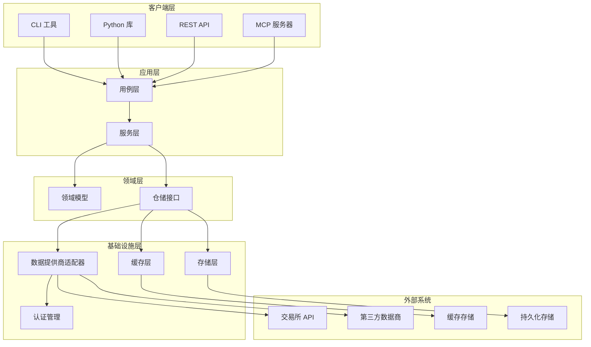
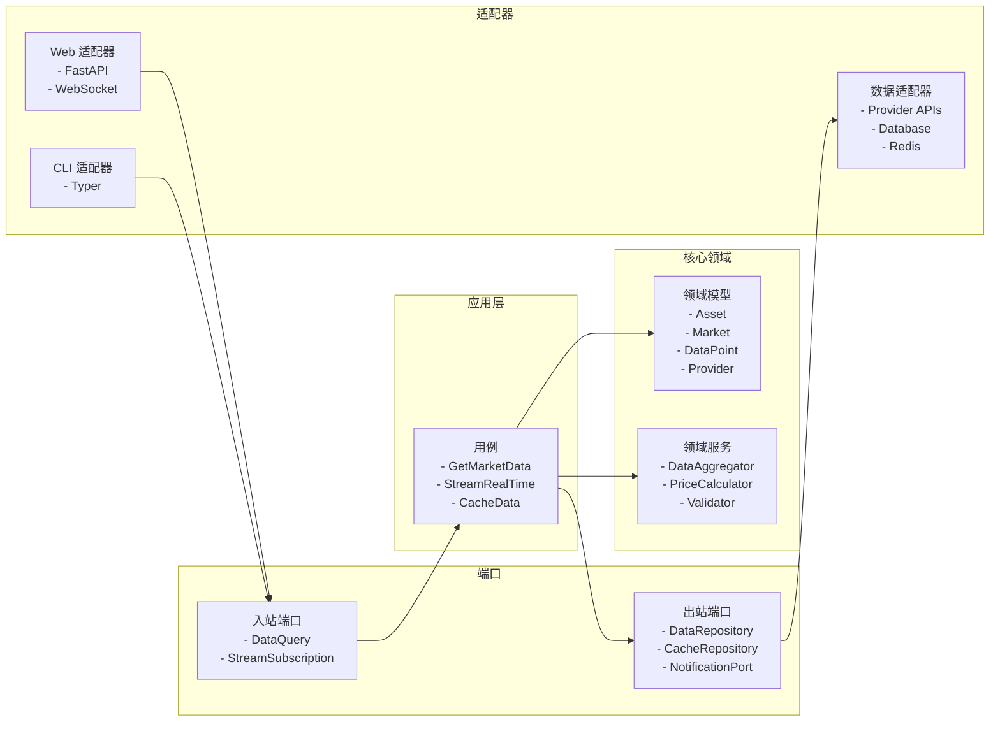
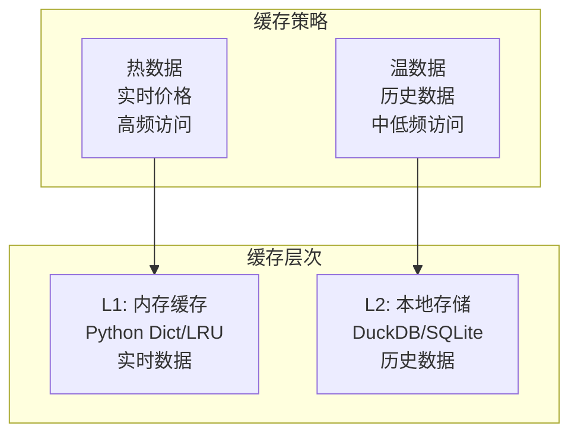
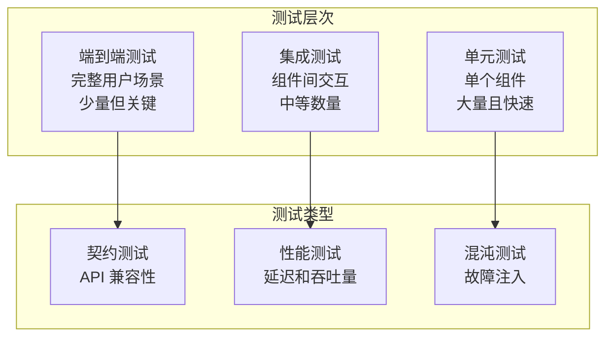

# vprism 系统设计文档

## 概述

vprism 是一个现代化的金融数据基础设施平台，旨在解决 akshare 等传统金融数据库的架构问题。通过采用领域驱动设计（DDD）、清洁架构原则和现代 Python 技术栈，vprism 提供统一的、可组合的 API 接口，支持多模态部署，为个人开发者到企业级应用提供高性能、可扩展的金融数据访问解决方案。

### 核心设计原则

1. **统一性优于分散性**：用一个可组合的 API 替代 1000+ 个分散函数
2. **现代性优于兼容性**：采用最新的 Python 生态系统和最佳实践
3. **可扩展性优于简单性**：设计支持从个人使用到企业级部署的扩展
4. **类型安全优于运行时检查**：100% 类型提示和编译时验证
5. **异步优于同步**：原生支持异步操作和并发处理

## 架构

### 高层架构



### 领域驱动设计架构

系统采用六边形架构（端口和适配器模式），确保业务逻辑与外部依赖的解耦：



## 组件和接口

### 核心组件架构

#### 1. 统一数据访问层 (Unified Data Access Layer)

```python
# 核心接口设计 - 支持简单和复杂查询
class DataQuery:
    asset: AssetType
    market: Optional[MarketType] = None
    provider: Optional[str] = None
    timeframe: Optional[TimeFrame] = None
    start: Optional[datetime] = None
    end: Optional[datetime] = None
    symbols: Optional[List[str]] = None

class DataResponse:
    data: List[DataPoint]
    metadata: ResponseMetadata
    source: ProviderInfo
    cached: bool
    timestamp: datetime

# 简单 API (保持易用性)
data = vprism.get(asset="stock", market="cn", symbols=["000001"])

# 构建器模式 API (支持复杂查询)
class QueryBuilder:
    def __init__(self):
        self._asset: Optional[AssetType] = None
        self._market: Optional[MarketType] = None
        self._symbols: Optional[List[str]] = None
        self._timeframe: Optional[TimeFrame] = None
        self._start: Optional[datetime] = None
        self._end: Optional[datetime] = None
        self._provider: Optional[str] = None

    def asset(self, asset: AssetType) -> 'QueryBuilder':
        self._asset = asset
        return self

    def market(self, market: MarketType) -> 'QueryBuilder':
        self._market = market
        return self

    def symbols(self, symbols: List[str]) -> 'QueryBuilder':
        self._symbols = symbols
        return self

    def timeframe(self, timeframe: TimeFrame) -> 'QueryBuilder':
        self._timeframe = timeframe
        return self

    def date_range(self, start: str, end: str) -> 'QueryBuilder':
        self._start = datetime.fromisoformat(start)
        self._end = datetime.fromisoformat(end)
        return self

    def provider(self, provider: str) -> 'QueryBuilder':
        self._provider = provider
        return self

    def build(self) -> DataQuery:
        return DataQuery(
            asset=self._asset,
            market=self._market,
            symbols=self._symbols,
            timeframe=self._timeframe,
            start=self._start,
            end=self._end,
            provider=self._provider
        )

# 使用示例
query = (vprism.query()
    .asset(AssetType.STOCK)
    .market(MarketType.CN)
    .symbols(["000001"])
    .timeframe(TimeFrame.DAY_1)
    .date_range("2024-01-01", "2024-12-31")
    .build())

data = await vprism.execute(query)
```

#### 2. 提供商抽象层 (Provider Abstraction Layer)

```python
from abc import ABC, abstractmethod
from dataclasses import dataclass
from typing import Dict, Set, Optional, List
from enum import Enum

class AuthType(str, Enum):
    API_KEY = "api_key"
    BEARER_TOKEN = "bearer_token"
    BASIC_AUTH = "basic_auth"
    OAUTH2 = "oauth2"
    NONE = "none"

@dataclass
class ProviderCapability:
    supported_assets: Set[AssetType]
    supported_markets: Set[MarketType]
    supported_timeframes: Set[TimeFrame]
    max_symbols_per_request: int
    supports_real_time: bool
    supports_historical: bool
    data_delay_seconds: int

@dataclass
class RateLimitConfig:
    requests_per_minute: int
    requests_per_hour: int
    concurrent_requests: int
    backoff_factor: float = 2.0
    max_retries: int = 3

@dataclass
class AuthConfig:
    auth_type: AuthType
    credentials: Dict[str, str]  # api_key, username, password, etc.

class DataProvider(ABC):
    def __init__(self, name: str, auth_config: AuthConfig, rate_limit: RateLimitConfig):
        self.name = name
        self.auth_config = auth_config
        self.rate_limit = rate_limit
        self._capability: Optional[ProviderCapability] = None

    @property
    def capability(self) -> ProviderCapability:
        if self._capability is None:
            self._capability = self._discover_capability()
        return self._capability

    @abstractmethod
    def _discover_capability(self) -> ProviderCapability:
        """发现提供商能力"""
        pass

    @abstractmethod
    async def get_data(self, query: DataQuery) -> DataResponse:
        pass

    @abstractmethod
    async def stream_data(self, query: DataQuery) -> AsyncIterator[DataPoint]:
        pass

    def can_handle_query(self, query: DataQuery) -> bool:
        """检查提供商是否能处理查询"""
        cap = self.capability

        if query.asset and query.asset not in cap.supported_assets:
            return False
        if query.market and query.market not in cap.supported_markets:
            return False
        if query.timeframe and query.timeframe not in cap.supported_timeframes:
            return False
        if query.symbols and len(query.symbols) > cap.max_symbols_per_request:
            return False

        return True

    async def authenticate(self) -> bool:
        """与提供商进行身份验证"""
        # 根据 auth_type 实现不同的认证方式
        pass

class ProviderRegistry:
    def __init__(self):
        self.providers: Dict[str, DataProvider] = {}
        self.provider_health: Dict[str, bool] = {}

    def register(self, provider: DataProvider):
        self.providers[provider.name] = provider
        self.provider_health[provider.name] = True

    def find_capable_providers(self, query: DataQuery) -> List[DataProvider]:
        """查找能处理此查询的提供商"""
        capable = []
        for provider in self.providers.values():
            if (self.provider_health.get(provider.name, False) and
                provider.can_handle_query(query)):
                capable.append(provider)
        return capable

    def mark_unhealthy(self, provider_name: str):
        self.provider_health[provider_name] = False

    def mark_healthy(self, provider_name: str):
        self.provider_health[provider_name] = True
```

#### 3. 智能路由器 (Intelligent Router)

```python
class DataRouter:
    def __init__(self, registry: ProviderRegistry):
        self.registry = registry
        self.provider_scores: Dict[str, float] = {}

    async def route_query(self, query: DataQuery) -> DataProvider:
        capable_providers = self.registry.find_capable_providers(query)

        if not capable_providers:
            raise NoCapableProviderException(f"No provider can handle query: {query}")

        # 简单评分：优先选择数据延迟较低的提供商
        best_provider = min(capable_providers,
                          key=lambda p: p.capability.data_delay_seconds)

        return best_provider

    def update_provider_score(self, provider_name: str, success: bool, latency_ms: int):
        """更新提供商性能评分"""
        current_score = self.provider_scores.get(provider_name, 1.0)

        if success:
            # 奖励成功和低延迟
            score_delta = 0.1 - (latency_ms / 10000)  # 高延迟惩罚
        else:
            # 失败惩罚
            score_delta = -0.2

        self.provider_scores[provider_name] = max(0.1, min(2.0, current_score + score_delta))
```

### 数据模型设计

#### 核心领域模型

```python
from pydantic import BaseModel, Field
from enum import Enum
from datetime import datetime
from decimal import Decimal
from typing import Optional, Dict, Any

class AssetType(str, Enum):
    STOCK = "stock"
    BOND = "bond"
    ETF = "etf"
    FUND = "fund"
    FUTURES = "futures"
    OPTIONS = "options"
    FOREX = "forex"
    CRYPTO = "crypto"
    INDEX = "index"
    COMMODITY = "commodity"

class MarketType(str, Enum):
    CN = "cn"  # 中国
    US = "us"  # 美国
    HK = "hk"  # 香港
    EU = "eu"  # 欧洲
    JP = "jp"  # 日本
    GLOBAL = "global"

class TimeFrame(str, Enum):
    TICK = "tick"
    MINUTE_1 = "1m"
    MINUTE_5 = "5m"
    MINUTE_15 = "15m"
    MINUTE_30 = "30m"
    HOUR_1 = "1h"
    HOUR_4 = "4h"
    DAY_1 = "1d"
    WEEK_1 = "1w"
    MONTH_1 = "1M"

class DataPoint(BaseModel):
    symbol: str
    timestamp: datetime
    open: Optional[Decimal] = None
    high: Optional[Decimal] = None
    low: Optional[Decimal] = None
    close: Optional[Decimal] = None
    volume: Optional[Decimal] = None
    amount: Optional[Decimal] = None
    extra_fields: Dict[str, Any] = Field(default_factory=dict)

    class Config:
        json_encoders = {
            Decimal: str,
            datetime: lambda v: v.isoformat()
        }

class Asset(BaseModel):
    symbol: str
    name: str
    asset_type: AssetType
    market: MarketType
    currency: str
    exchange: Optional[str] = None
    sector: Optional[str] = None
    industry: Optional[str] = None
    metadata: Dict[str, Any] = Field(default_factory=dict)
```

### 缓存和存储策略

#### 多层缓存架构



#### 缓存实现

```python
import hashlib
from datetime import datetime, timezone, timedelta
from typing import Optional, Any, Dict
import asyncio
from collections import OrderedDict

class CacheKey:
    def __init__(self, query: DataQuery):
        self.key = self._generate_key(query)
        self.ttl = self._calculate_ttl(query)

    def _generate_key(self, query: DataQuery) -> str:
        """生成确定性缓存键"""
        parts = [
            query.asset.value if query.asset else "any",
            query.market.value if query.market else "any",
            "|".join(sorted(query.symbols)) if query.symbols else "all",
            query.timeframe.value if query.timeframe else "any",
            query.start.isoformat() if query.start else "",
            query.end.isoformat() if query.end else "",
            query.provider or "auto"
        ]
        content = "|".join(parts)
        return hashlib.sha256(content.encode()).hexdigest()[:16]

    def _calculate_ttl(self, query: DataQuery) -> int:
        """根据数据类型和时间框架计算 TTL"""
        if not query.timeframe:
            return 300  # 5分钟默认

        ttl_map = {
            TimeFrame.TICK: 5,      # 5秒
            TimeFrame.MINUTE_1: 60,  # 1分钟
            TimeFrame.MINUTE_5: 300, # 5分钟
            TimeFrame.DAY_1: 3600,   # 1小时
            TimeFrame.WEEK_1: 86400, # 1天
        }
        return ttl_map.get(query.timeframe, 300)

class CacheStrategy(ABC):
    @abstractmethod
    async def get(self, key: str) -> Optional[Any]:
        pass

    @abstractmethod
    async def set(self, key: str, value: Any, ttl: Optional[int] = None):
        pass

class ThreadSafeInMemoryCache:
    """线程安全的内存 LRU 缓存"""
    def __init__(self, max_size: int = 1000):
        self.max_size = max_size
        self.cache: OrderedDict = OrderedDict()
        self.expiry: Dict[str, datetime] = {}
        self._lock = asyncio.Lock()

    async def get(self, key: str) -> Optional[Any]:
        async with self._lock:
            now = datetime.now(timezone.utc)

            # 检查过期
            if key in self.expiry and now > self.expiry[key]:
                self._remove_expired(key)
                return None

            if key in self.cache:
                # 移动到末尾（最近使用）
                self.cache.move_to_end(key)
                return self.cache[key]
            return None

    async def set(self, key: str, value: Any, ttl: Optional[int] = None):
        async with self._lock:
            now = datetime.now(timezone.utc)

            if key in self.cache:
                self.cache.move_to_end(key)
            else:
                if len(self.cache) >= self.max_size:
                    # 移除最少使用的
                    oldest_key = next(iter(self.cache))
                    self._remove_expired(oldest_key)

            self.cache[key] = value
            if ttl:
                self.expiry[key] = now + timedelta(seconds=ttl)

    def _remove_expired(self, key: str):
        self.cache.pop(key, None)
        self.expiry.pop(key, None)

class SimpleDuckDBCache:
    """DuckDB 本地存储缓存 - 简化设计"""
    def __init__(self, db_path: str = "vprism_cache.duckdb"):
        self.db_path = db_path
        self._init_simple_tables()

    def _init_simple_tables(self):
        """初始化简化的缓存表和优化的数据表结构"""
        # 简单缓存表
        cache_sql = """
        CREATE TABLE IF NOT EXISTS cache_entries (
            cache_key VARCHAR(32) PRIMARY KEY,
            data_json TEXT NOT NULL,
            expires_at TIMESTAMP,
            created_at TIMESTAMP DEFAULT CURRENT_TIMESTAMP
        );

        CREATE INDEX IF NOT EXISTS idx_cache_expires
        ON cache_entries(expires_at);
        """

        # 优化的数据表结构 - 按频率和类型分离
        data_tables_sql = """
        -- 日线数据表（分区优化）
        CREATE TABLE IF NOT EXISTS daily_ohlcv (
            symbol VARCHAR(32) NOT NULL,
            trade_date DATE NOT NULL,
            market VARCHAR(8) NOT NULL,
            open_price DECIMAL(18,6) NOT NULL,
            high_price DECIMAL(18,6) NOT NULL,
            low_price DECIMAL(18,6) NOT NULL,
            close_price DECIMAL(18,6) NOT NULL,
            volume DECIMAL(20,2) NOT NULL,
            amount DECIMAL(20,2),
            provider VARCHAR(32) NOT NULL,
            created_at TIMESTAMP DEFAULT CURRENT_TIMESTAMP,
            PRIMARY KEY (symbol, trade_date, market)
        );

        -- 分钟级数据表
        CREATE TABLE IF NOT EXISTS intraday_ohlcv (
            symbol VARCHAR(32) NOT NULL,
            timestamp TIMESTAMP NOT NULL,
            market VARCHAR(8) NOT NULL,
            timeframe VARCHAR(8) NOT NULL, -- 1m, 5m, 15m, 1h
            open_price DECIMAL(18,6) NOT NULL,
            high_price DECIMAL(18,6) NOT NULL,
            low_price DECIMAL(18,6) NOT NULL,
            close_price DECIMAL(18,6) NOT NULL,
            volume DECIMAL(20,2) NOT NULL,
            provider VARCHAR(32) NOT NULL,
            created_at TIMESTAMP DEFAULT CURRENT_TIMESTAMP,
            PRIMARY KEY (symbol, timestamp, timeframe, market)
        );

        -- 资产信息表
        CREATE TABLE IF NOT EXISTS asset_info (
            symbol VARCHAR(32) NOT NULL,
            market VARCHAR(8) NOT NULL,
            name VARCHAR(256),
            asset_type VARCHAR(16) NOT NULL,
            currency VARCHAR(8),
            exchange VARCHAR(16),
            is_active BOOLEAN DEFAULT TRUE,
            provider VARCHAR(32) NOT NULL,
            updated_at TIMESTAMP DEFAULT CURRENT_TIMESTAMP,
            PRIMARY KEY (symbol, market)
        );

        -- 优化的索引
        CREATE INDEX IF NOT EXISTS idx_daily_ohlcv_date ON daily_ohlcv(trade_date DESC);
        CREATE INDEX IF NOT EXISTS idx_daily_ohlcv_symbol ON daily_ohlcv(symbol, trade_date DESC);
        CREATE INDEX IF NOT EXISTS idx_intraday_timestamp ON intraday_ohlcv(timestamp DESC);
        CREATE INDEX IF NOT EXISTS idx_intraday_symbol_time ON intraday_ohlcv(symbol, timestamp DESC);
        CREATE INDEX IF NOT EXISTS idx_asset_type ON asset_info(asset_type, market);
        """

    async def get(self, key: str) -> Optional[Any]:
        """从 DuckDB 查询缓存数据"""
        # 解析缓存键，确定查询类型和参数
        query_info = self._parse_cache_key(key)

        if query_info['data_type'] == 'ohlcv':
            return await self._get_ohlcv_data(query_info)
        elif query_info['data_type'] == 'quote':
            return await self._get_quote_data(query_info)
        # ... 其他数据类型

        return None

    async def set(self, key: str, value: Any, ttl: Optional[int] = None):
        """存储数据到 DuckDB"""
        # 根据数据类型存储到相应表
        pass

    def _parse_cache_key(self, key: str) -> Dict[str, Any]:
        """解析缓存键获取查询信息"""
        # 实现缓存键解析逻辑
        pass

class MultiLevelCache:
    def __init__(self):
        self.l1_cache = ThreadSafeInMemoryCache(max_size=1000)
        self.l2_cache = SimpleDuckDBCache()

    async def get_data(self, query: DataQuery) -> Optional[DataResponse]:
        cache_key_obj = CacheKey(query)

        # 尝试 L1 缓存
        result = await self.l1_cache.get(cache_key_obj.key)
        if result:
            return result

        # 尝试 L2 缓存
        result = await self.l2_cache.get(cache_key_obj.key)
        if result:
            # 回填到 L1
            await self.l1_cache.set(cache_key_obj.key, result, ttl=300)
            return result

        return None

    async def set_data(self, query: DataQuery, data: DataResponse):
        cache_key_obj = CacheKey(query)

        # 使用适当的 TTL 存储到两个级别
        await self.l1_cache.set(cache_key_obj.key, data, ttl=cache_key_obj.ttl)
        await self.l2_cache.set(cache_key_obj.key, data, ttl=cache_key_obj.ttl * 10)
```

## 错误处理

### 统一错误处理架构

```python
class VPrismException(Exception):
    """vprism 基础异常类"""
    def __init__(self, message: str, error_code: str, details: Dict[str, Any] = None):
        self.message = message
        self.error_code = error_code
        self.details = details or {}
        super().__init__(message)

class ProviderException(VPrismException):
    """数据提供商相关异常"""
    pass

class RateLimitException(ProviderException):
    """速率限制异常"""
    pass

class DataValidationException(VPrismException):
    """数据验证异常"""
    pass

class ErrorHandler:
    async def handle_provider_error(self, error: Exception, provider: str) -> DataResponse:
        if isinstance(error, RateLimitException):
            # 实施退避策略
            await self.backoff_strategy.wait()
            # 尝试备用提供商
            return await self.try_fallback_provider()
        elif isinstance(error, ProviderException):
            # 记录错误并返回错误响应
            logger.error(f"Provider {provider} failed: {error}")
            return self.create_error_response(error)
        else:
            # 未知错误，重新抛出
            raise error
```

### 故障转移和重试机制

```python
class FaultTolerantDataService:
    def __init__(self, providers: List[DataProvider]):
        self.providers = providers
        self.circuit_breaker = CircuitBreaker()
        self.retry_policy = ExponentialBackoffRetry()

    async def get_data_with_fallback(self, query: DataQuery) -> DataResponse:
        for provider in self.providers:
            try:
                if self.circuit_breaker.is_open(provider.name):
                    continue

                return await self.retry_policy.execute(
                    lambda: provider.get_data(query)
                )
            except Exception as e:
                self.circuit_breaker.record_failure(provider.name)
                logger.warning(f"Provider {provider.name} failed: {e}")
                continue

        raise NoAvailableProviderException("All providers failed")
```

## 测试策略

### 测试金字塔



### 测试实现策略

```python
# 单元测试示例
class TestDataRouter:
    @pytest.fixture
    def mock_providers(self):
        return [
            MockProvider("provider_a", [AssetType.STOCK]),
            MockProvider("provider_b", [AssetType.BOND])
        ]

    @pytest.mark.asyncio
    async def test_route_stock_query(self, mock_providers):
        router = DataRouter(mock_providers)
        query = DataQuery(asset=AssetType.STOCK, market=MarketType.CN)

        provider = await router.route_query(query)

        assert provider.name == "provider_a"
        assert AssetType.STOCK in provider.supported_assets

# 集成测试示例
class TestDataService:
    @pytest.mark.integration
    async def test_get_stock_data_with_cache(self):
        service = DataService()
        query = DataQuery(
            asset=AssetType.STOCK,
            market=MarketType.CN,
            symbols=["000001"]
        )

        # 第一次请求应该从提供商获取
        response1 = await service.get_data(query)
        assert not response1.cached

        # 第二次请求应该从缓存获取
        response2 = await service.get_data(query)
        assert response2.cached

# 性能测试示例
class TestPerformance:
    @pytest.mark.performance
    async def test_concurrent_requests(self):
        service = DataService()
        queries = [
            DataQuery(asset=AssetType.STOCK, symbols=[f"00000{i}"])
            for i in range(100)
        ]

        start_time = time.time()
        responses = await asyncio.gather(*[
            service.get_data(query) for query in queries
        ])
        end_time = time.time()

        assert len(responses) == 100
        assert end_time - start_time < 5.0  # 5秒内完成100个请求
```

### 测试数据管理

```python
class TestDataFactory:
    @staticmethod
    def create_stock_data(symbol: str = "000001", days: int = 30) -> List[DataPoint]:
        base_date = datetime.now() - timedelta(days=days)
        return [
            DataPoint(
                symbol=symbol,
                timestamp=base_date + timedelta(days=i),
                open=Decimal("10.00") + Decimal(str(random.uniform(-1, 1))),
                high=Decimal("10.50") + Decimal(str(random.uniform(-1, 1))),
                low=Decimal("9.50") + Decimal(str(random.uniform(-1, 1))),
                close=Decimal("10.00") + Decimal(str(random.uniform(-1, 1))),
                volume=Decimal(str(random.randint(1000000, 10000000)))
            )
            for i in range(days)
        ]

    @staticmethod
    def create_mock_provider(name: str, assets: List[AssetType]) -> MockProvider:
        return MockProvider(
            name=name,
            supported_assets=set(assets),
            test_data=TestDataFactory.create_stock_data()
        )
```

这个设计文档涵盖了 vprism 的核心架构、组件设计、数据模型、错误处理和测试策略。设计遵循了现代软件架构的最佳实践，确保系统的可扩展性、可维护性和高性能。
## 多
模态部署架构

### 部署模式对比

| 部署模式 | 目标用户 | 特点 | 技术栈 |
|---------|---------|------|--------|
| 库模式 | 个人开发者、数据科学家 | 轻量级、易集成 | Python Package |
| 服务模式 | 企业、团队 | 高并发、可扩展 | FastAPI + Docker |
| MCP 模式 | AI 助手、自动化 | 标准化接口 | FastMCP Server |
| 容器模式 | 生产环境 | 高可用、监控 | Docker + Docker Compose |

### 1. 库模式 (Library Mode)

```python
# 用户使用示例
import vprism

# 同步接口
data = vprism.get(asset="stock", market="cn", symbols=["000001"])

# 异步接口
async def get_data():
    async with vprism.AsyncClient() as client:
        data = await client.get(asset="stock", market="cn", symbols=["000001"])
        async for point in client.stream(asset="stock", symbols=["000001"]):
            print(point)

# 配置管理
vprism.configure(
    providers=["akshare", "yahoo"],
    cache_backend="redis://localhost:6379",
    log_level="INFO"
)
```

### 2. 服务模式 (Service Mode) - RESTRUCTURED

```python
# FastAPI 应用结构 - 扁平化模块架构
from fastapi import FastAPI, Depends
from src.vprism_web.app import create_app
from src.vprism_web.services.data_service import DataService

app = create_app()

@app.get("/api/v1/data")
async def get_market_data(
    asset: AssetType,
    market: MarketType = None,
    symbols: List[str] = Query(...),
    service: DataService = Depends(get_data_service)
):
    query = DataQuery(asset=asset, market=market, symbols=symbols)
    return await service.get_data(query)

@app.get("/api/v1/assets")
async def list_assets(
    asset_type: Optional[AssetType] = None,
    market: Optional[MarketType] = None,
    service: DataService = Depends(get_data_service)
):
    return await service.list_assets(asset_type, market)

@app.get("/api/v1/health")
async def health_check():
    return {"status": "healthy", "timestamp": datetime.utcnow()}
```

### 3. MCP 模式 (Model Context Protocol) - RESTRUCTURED

```python
# FastMCP 服务器实现 - 扁平化模块架构
from fastmcp import FastMCP
from src.vprism_mcp.server import VPrismMCPServer

mcp = FastMCP("vprism-financial-data")

@mcp.tool()
async def get_stock_data(
    symbols: List[str],
    market: str = "cn",
    timeframe: str = "1d"
) -> Dict[str, Any]:
    """获取股票数据的 MCP 工具"""
    service = VPrismMCPServer()
    return await service.get_stock_data(symbols, market, timeframe)

@mcp.tool()
async def get_market_overview(market: str = "cn") -> Dict[str, Any]:
    """获取市场概览的 MCP 工具"""
    service = VPrismMCPServer()
    return await service.get_market_overview(market)

if __name__ == "__main__":
    mcp.run()
```

### 4. 容器模式 (Container Mode) - RESTRUCTURED

```dockerfile
# Dockerfile - 扁平化模块架构
FROM python:3.12-slim

WORKDIR /app

# 安装 uv
RUN pip install uv

# 复制依赖文件
COPY pyproject.toml uv.lock ./

# 安装依赖
RUN uv sync --frozen

# 复制应用代码
COPY src/vprism src/vprism/
COPY src/vprism-web src/vprism-web/
COPY src/vprism-mcp src/vprism-mcp/
COPY src/vprism-docker src/vprism-docker/

# 健康检查
HEALTHCHECK --interval=30s --timeout=10s --start-period=5s --retries=3 \
    CMD curl -f http://localhost:8000/api/v1/health || exit 1

# 启动应用
CMD ["uv", "run", "uvicorn", "src.vprism-web.main:app", "--host", "0.0.0.0", "--port", "8000"]
```

```yaml
# Docker Compose 配置 - RESTRUCTURED
version: '3.8'

services:
  vprism-api:
    build: .
    ports:
      - "8000:8000"
    environment:
      - PYTHONPATH=/app/src
      - REDIS_URL=redis://redis:6379
      - LOG_LEVEL=INFO
    depends_on:
      - redis
    healthcheck:
      test: ["CMD", "curl", "-f", "http://localhost:8000/api/v1/health"]
      interval: 30s
      timeout: 10s
      retries: 3
      start_period: 5s

  redis:
    image: redis:7-alpine
    ports:
      - "6379:6379"
    healthcheck:
      test: ["CMD", "redis-cli", "ping"]
      interval: 30s
      timeout: 10s
      retries: 3

  nginx:
    image: nginx:alpine
    ports:
      - "80:80"
      - "443:443"
    volumes:
      - ./nginx.conf:/etc/nginx/nginx.conf
      - ./ssl:/etc/nginx/ssl
    depends_on:
      - vprism-api
```

## 技术栈详细说明

### 核心技术栈

```toml
# pyproject.toml
[project]
name = "vprism"
version = "0.1.0"
description = "Modern Financial Data Infrastructure"
authors = [{name = "vprism Team"}]
requires-python = ">=3.11"
dependencies = [
    # 核心框架
    "fastapi>=0.104.0",
    "uvicorn[standard]>=0.24.0",
    "pydantic>=2.5.0",

    # HTTP 客户端
    "httpx>=0.25.0",

    # 数据处理和存储
    "pandas>=2.1.0",
    "polars>=0.19.0",
    "duckdb>=0.9.0",
    "sqlite3",  # 内置，用作备选存储

    # 命令行
    "typer>=0.9.0",
    "rich>=13.0.0",

    # 日志和监控
    "loguru>=0.7.0",
    "prometheus-client>=0.19.0",
    "opentelemetry-api>=1.21.0",

    # 配置管理
    "pydantic-settings>=2.1.0",
    "toml>=0.10.0",

    # 安全
    "cryptography>=41.0.0",
    "python-jose[cryptography]>=3.3.0",

    # MCP 支持
    "fastmcp>=0.2.0",

    # 测试
    "pytest>=7.4.0",
    "pytest-asyncio>=0.21.0",
    "pytest-cov>=4.1.0",
    "httpx[test]>=0.25.0",
]

[project.optional-dependencies]
dev = [
    "ruff>=0.1.0",
    "mypy>=1.7.0",
    "black>=23.0.0",
    "pre-commit>=3.5.0",
]

[tool.ruff]
target-version = "py311"
line-length = 88
select = ["E", "F", "I", "N", "W", "UP", "B", "C4", "SIM", "TCH"]

[tool.mypy]
python_version = "3.11"
strict = true
warn_return_any = true
warn_unused_configs = true
```

### 数据处理管道

```python
class DataPipeline:
    def __init__(self):
        self.extractors = ExtractorRegistry()
        self.transformers = TransformerRegistry()
        self.loaders = LoaderRegistry()

    async def process(self, query: DataQuery) -> DataResponse:
        # ETL 管道
        raw_data = await self.extract(query)
        clean_data = await self.transform(raw_data)
        result = await self.load(clean_data)
        return result

    async def extract(self, query: DataQuery) -> RawData:
        extractor = self.extractors.get_extractor(query.provider)
        return await extractor.extract(query)

    async def transform(self, raw_data: RawData) -> CleanData:
        transformer = self.transformers.get_transformer(raw_data.source_type)
        return await transformer.transform(raw_data)

    async def load(self, clean_data: CleanData) -> DataResponse:
        loader = self.loaders.get_loader(clean_data.target_format)
        return await loader.load(clean_data)
```

### 批量数据处理管道

```python
class BatchDataProcessor:
    def __init__(self, cache: MultiLevelCache):
        self.cache = cache
        self.batch_size = 1000

    async def process_batch(self, queries: List[DataQuery]) -> List[DataResponse]:
        """批量处理数据查询，优化性能"""
        results = []

        # 按提供商分组查询
        grouped_queries = self._group_by_provider(queries)

        for provider, provider_queries in grouped_queries.items():
            batch_results = await self._process_provider_batch(provider, provider_queries)
            results.extend(batch_results)

        return results

    async def _process_provider_batch(self, provider: str, queries: List[DataQuery]) -> List[DataResponse]:
        """处理单个提供商的批量查询"""
        # 实现批量查询逻辑，减少 API 调用次数
        pass

    def _group_by_provider(self, queries: List[DataQuery]) -> Dict[str, List[DataQuery]]:
        """按数据提供商分组查询"""
        groups = {}
        for query in queries:
            provider = query.provider or "auto"
            if provider not in groups:
                groups[provider] = []
            groups[provider].append(query)
        return groups
```

### 监控和可观测性

```python
from prometheus_client import Counter, Histogram, Gauge
from opentelemetry import trace

# 指标定义
REQUEST_COUNT = Counter('vprism_requests_total', 'Total requests', ['method', 'endpoint'])
REQUEST_DURATION = Histogram('vprism_request_duration_seconds', 'Request duration')
ACTIVE_CONNECTIONS = Gauge('vprism_active_connections', 'Active connections')

tracer = trace.get_tracer(__name__)

class MonitoringMiddleware:
    async def __call__(self, request: Request, call_next):
        with tracer.start_as_current_span("http_request") as span:
            start_time = time.time()

            # 记录请求
            REQUEST_COUNT.labels(
                method=request.method,
                endpoint=request.url.path
            ).inc()

            try:
                response = await call_next(request)
                span.set_attribute("http.status_code", response.status_code)
                return response
            except Exception as e:
                span.record_exception(e)
                raise
            finally:
                # 记录响应时间
                REQUEST_DURATION.observe(time.time() - start_time)

class HealthCheck:
    def __init__(self, data_service: DataService):
        self.data_service = data_service

    async def check_health(self) -> Dict[str, Any]:
        checks = {
            "database": await self.check_database(),
            "cache": await self.check_cache(),
            "providers": await self.check_providers(),
        }

        overall_status = "healthy" if all(
            check["status"] == "healthy" for check in checks.values()
        ) else "unhealthy"

        return {
            "status": overall_status,
            "timestamp": datetime.utcnow().isoformat(),
            "checks": checks
        }
```

### 安全和认证

```python
class SecurityManager:
    def __init__(self, secret_key: str):
        self.secret_key = secret_key
        self.token_manager = TokenManager(secret_key)

    async def authenticate_request(self, request: Request) -> Optional[User]:
        auth_header = request.headers.get("Authorization")
        if not auth_header or not auth_header.startswith("Bearer "):
            return None

        token = auth_header[7:]  # Remove "Bearer " prefix
        return await self.token_manager.verify_token(token)

    def encrypt_api_key(self, api_key: str) -> str:
        fernet = Fernet(self.secret_key.encode())
        return fernet.encrypt(api_key.encode()).decode()

    def decrypt_api_key(self, encrypted_key: str) -> str:
        fernet = Fernet(self.secret_key.encode())
        return fernet.decrypt(encrypted_key.encode()).decode()

class RateLimiter:
    def __init__(self, redis_client: Redis):
        self.redis = redis_client

    async def check_rate_limit(self, user_id: str, endpoint: str) -> bool:
        key = f"rate_limit:{user_id}:{endpoint}"
        current = await self.redis.get(key)

        if current is None:
            await self.redis.setex(key, 3600, 1)  # 1 hour window
            return True

        if int(current) >= 1000:  # 1000 requests per hour
            return False

        await self.redis.incr(key)
        return True
```

这个设计文档现在包含了完整的系统架构、多模态部署方案、技术栈选择和实现细节。设计充分考虑了现代软件开发的最佳实践，确保系统的可扩展性、可维护性和高性能。